<h1 align="center">miniRT</h1>
<h3 align="center">42Paris School Project</h3>

<p align="center">
  
  
  
  
</p>

## About the Project

**miniRT** is a ray tracing program written in C using the **MiniLibX** library. It renders basic 3D scenes by simulating how light interacts with geometric objects. Created for 42Paris, this project builds on your knowledge of C programming, mathematical transformations, and real-time rendering techniques.

## Features

- Parse and render scene descriptions from “.rt” files  
- Supports basic geometric shapes: Plane, Sphere, Cylinder  
- Ambient and diffuse lighting, plus hard shadows  
- Rotations and translations of shapes, lights, and cameras  
- Window event handling (close by pressing ESC or clicking the red cross)

## Technical Details

- **Language**: C  
- **Libraries**: MiniLibX, libft, math library (compile with -lm)  
- **Raytracing**: Compute intersections, apply transformations, manage shadows, etc.  

## Getting Started

### Prerequisites
- GCC or any C compiler  
- GNU Make  
- MiniLibX (included in the repo under `Libs/`)

### Installation

1. Clone the repository:
   ```sh
   git clone https://github.com/Agrippa2023/miniRT.git
   cd miniRT
   ```
2. Build the project:
   ```sh
   make
   ```

### Usage

Run the program by specifying a valid “.rt” scene file:
```sh
./miniRT path/to/scene.rt
```


Some sample scene files are located in the `Scene_files/` directory. Each file describes a 3D scene with objects, lights, and camera settings. Simply pass a valid “.rt” file to `miniRT` at launch.

```sh
./miniRT Scene_files/img17.rt
```

<p align="center">
  <!-- GIF showing how to launch the program -->
  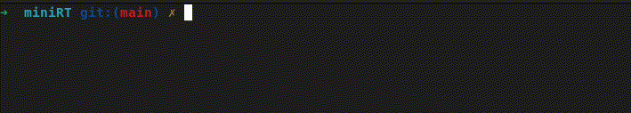
</p>

## Project Structure

- `Srcs/`: Source code (grouped by modules like `Camera`, `Shapes`, `Ray`, `parser`, etc.)  
- `Includes/`: Header files  
- `Libs/`: External libraries (`libft`, `minilibx-linux`)  
- `Scene_files`: Sample scene files (*.rt)  
- `images/`: Examples of 3D scenes generated with miniRT  
- `textures/`: Additional texture assets  
- `Makefile/`: Build script  

## Screenshots

<p align="center">
  <!-- Example: replace these with actual output images -->
  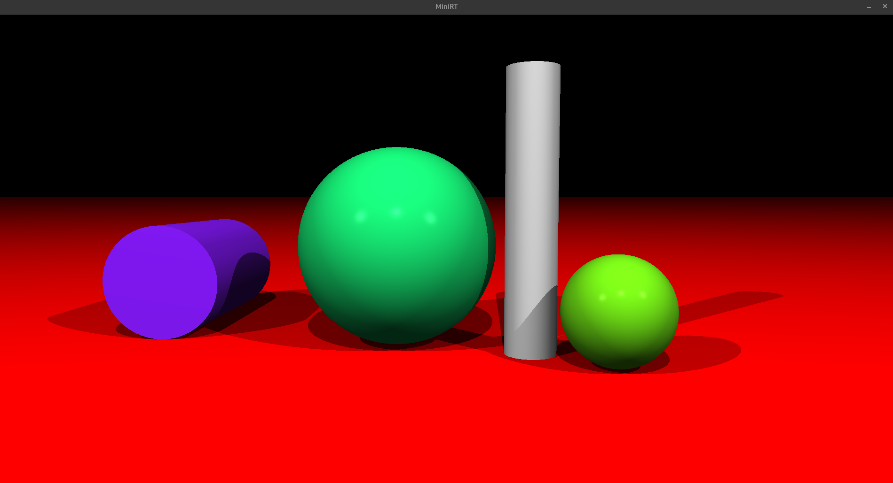
  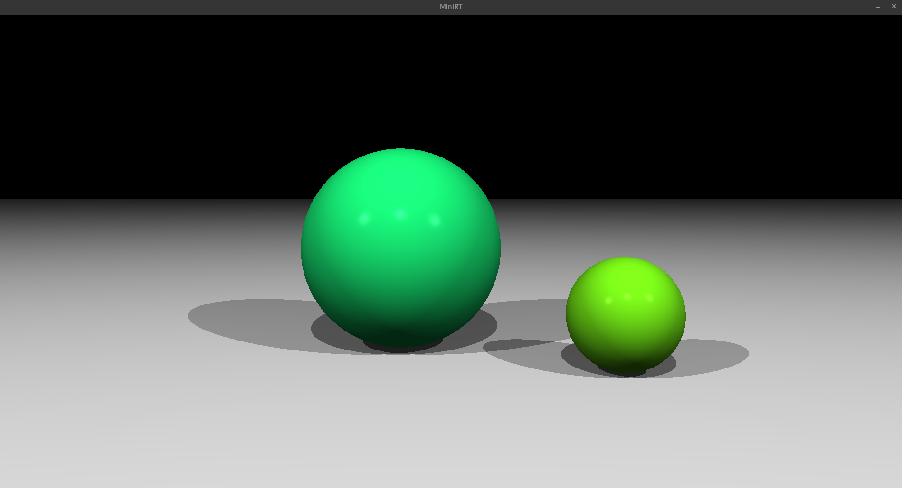
  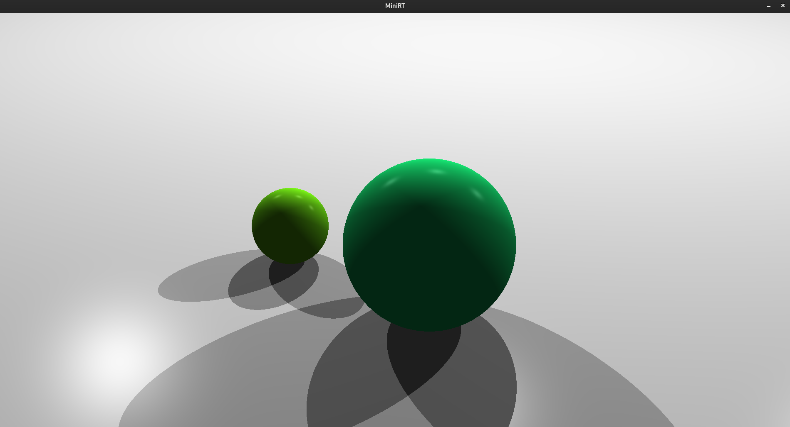
  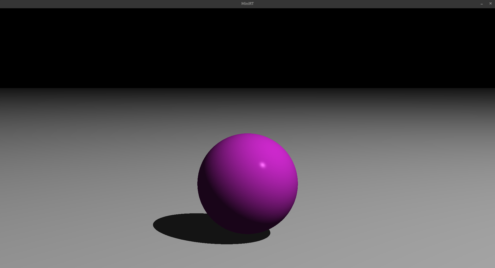
  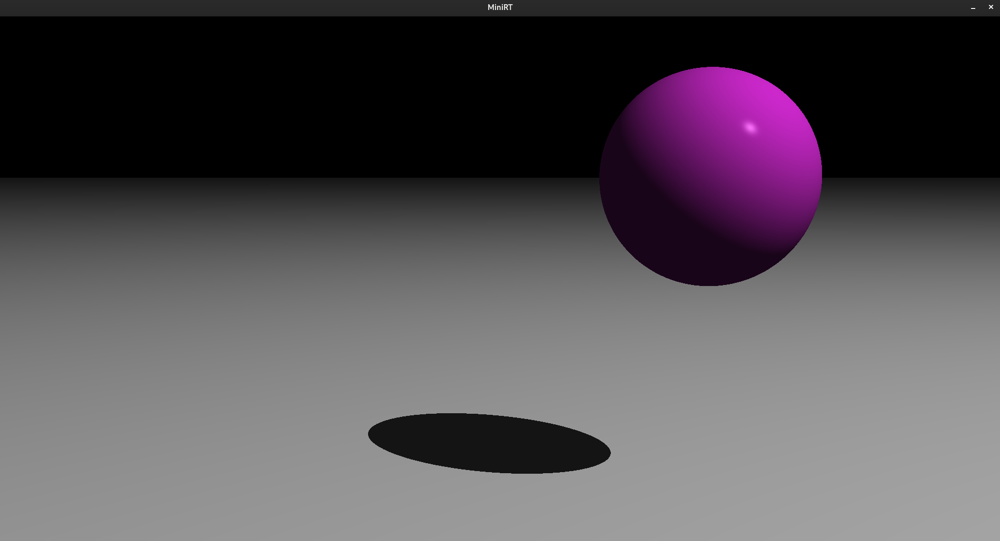
  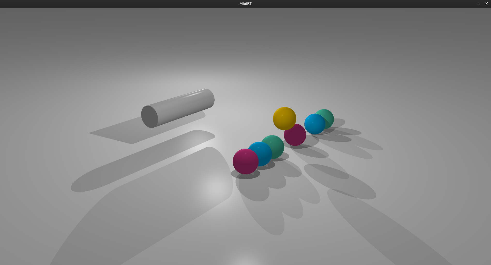
  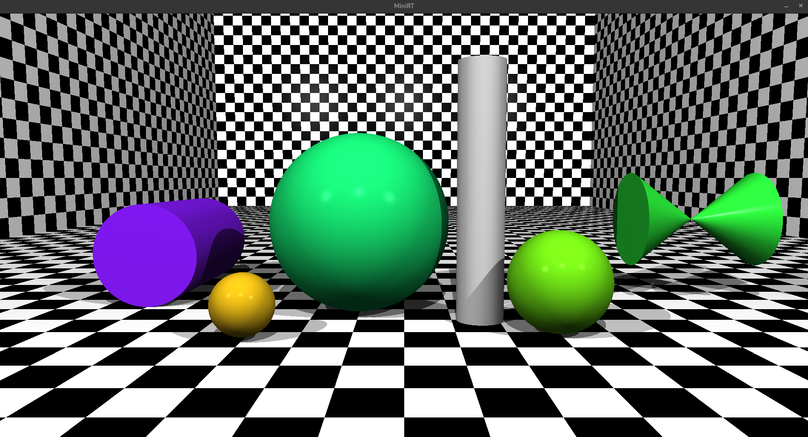
  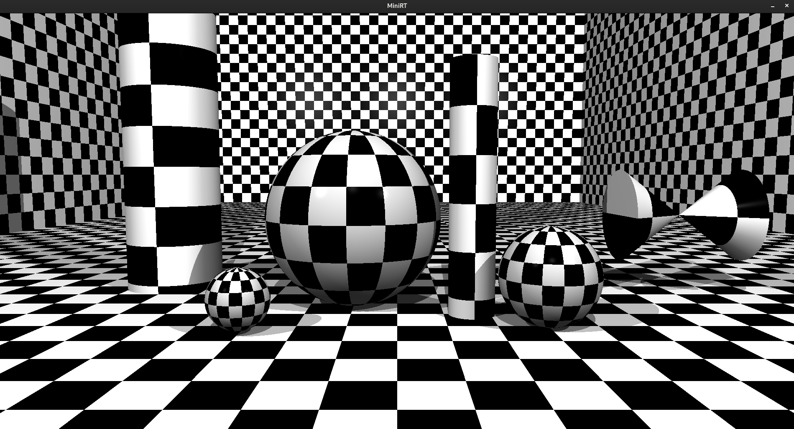
</p>

## Examples

### Colored Lights
<p align="center">
  <!-- Highlights multiple colored lights in this scene -->
  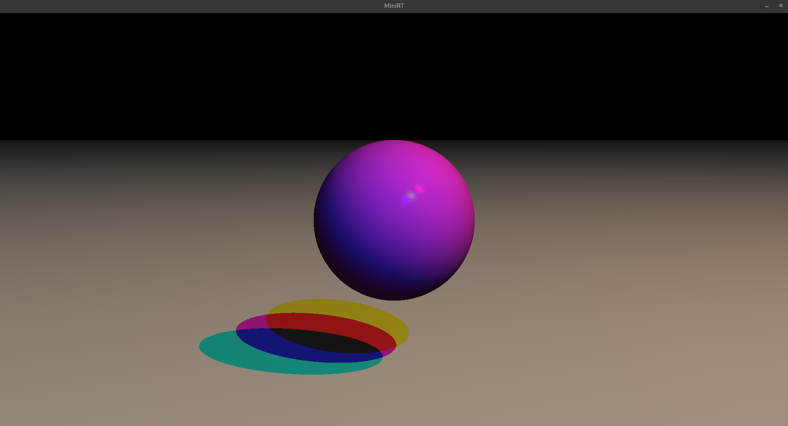
</p>

### Textured Scenes
<p align="center">
  <!-- Show off textured images -->
  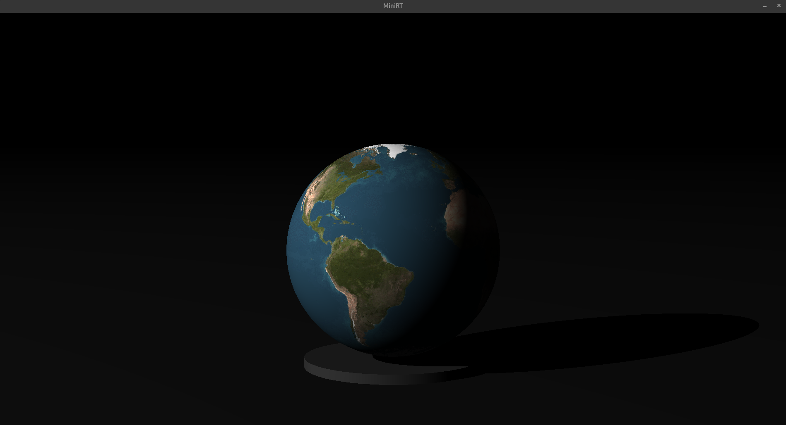
  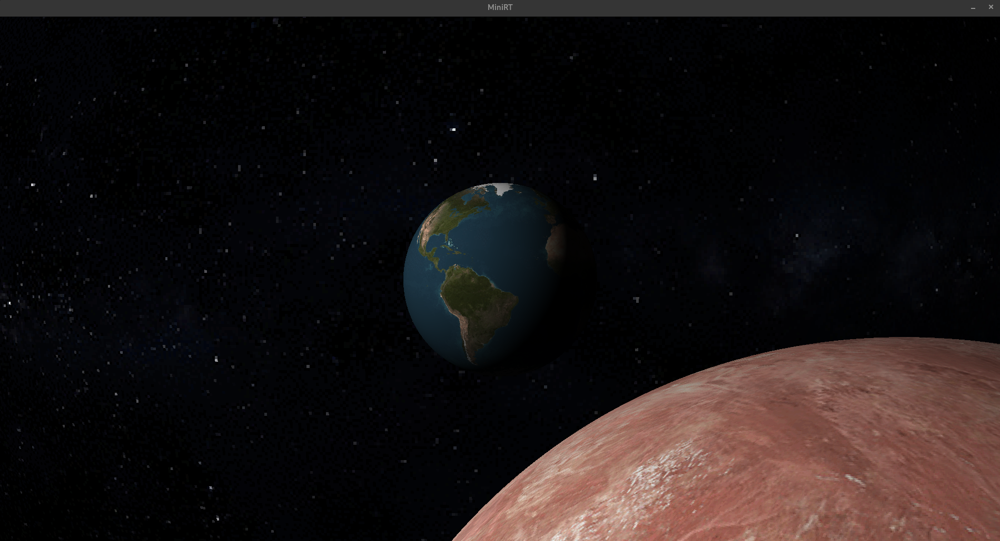
</p>


## Acknowledgements

Developed at 42Paris. Special thanks to the 42 community for its resources and everyone who contributed helpful references.

## License

Distributed under the MIT License. See `LICENSE` for more information.

## Connect with Me

<p align="left">
  <a href="https://www.linkedin.com/in/amine-ouichou-168236345" target="blank"></a>
</p>
